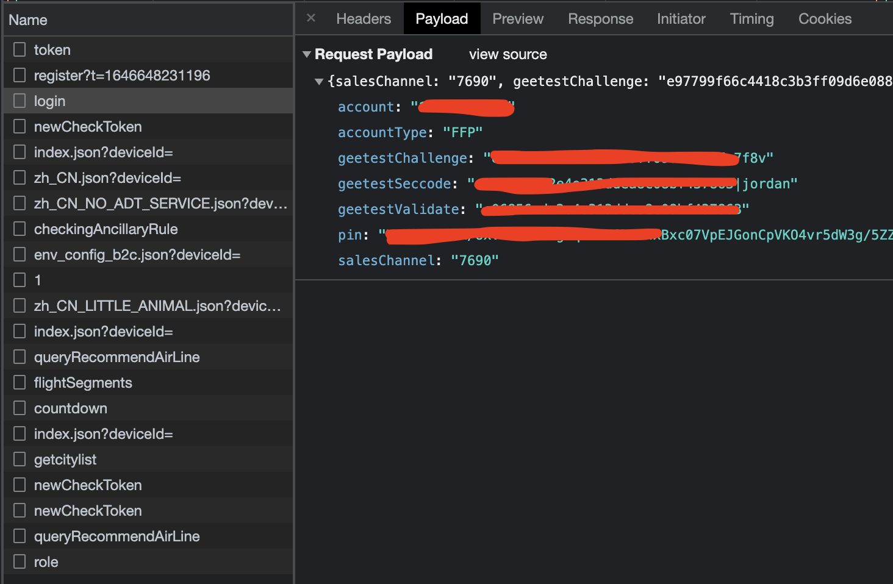
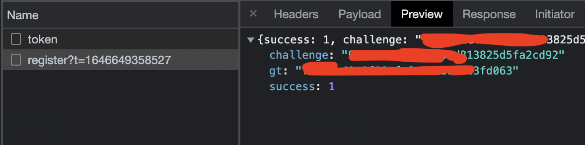
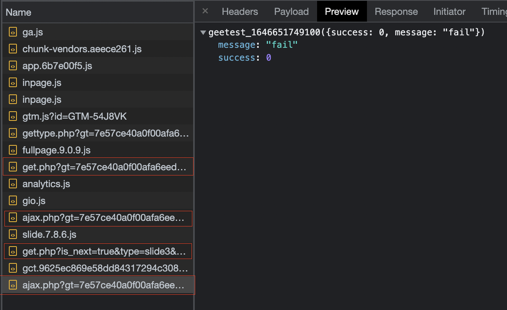
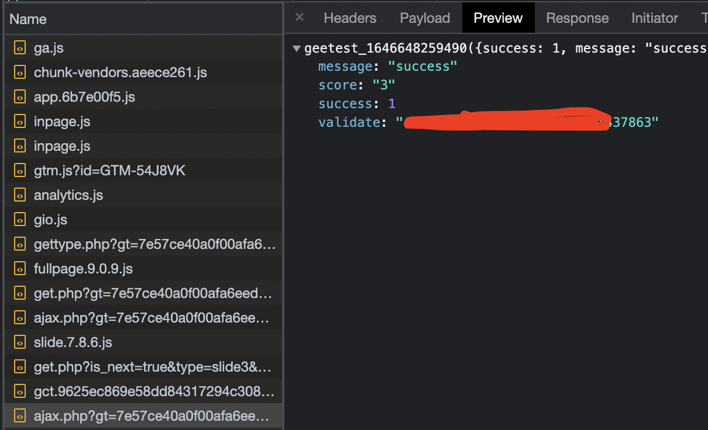
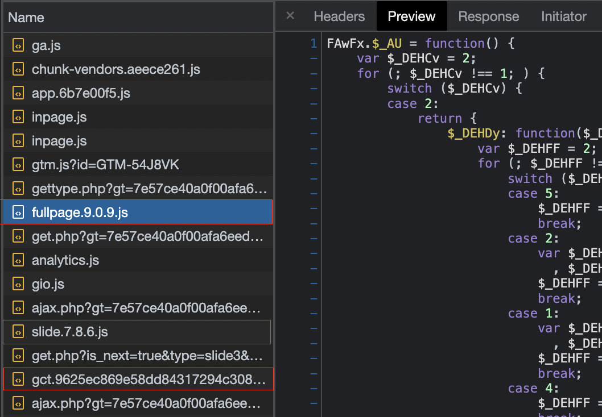
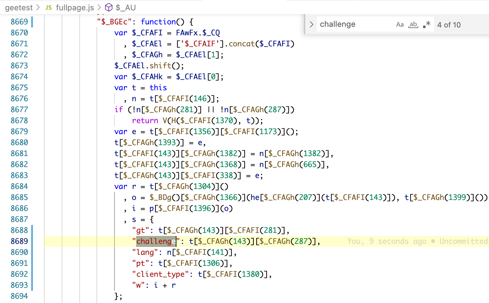
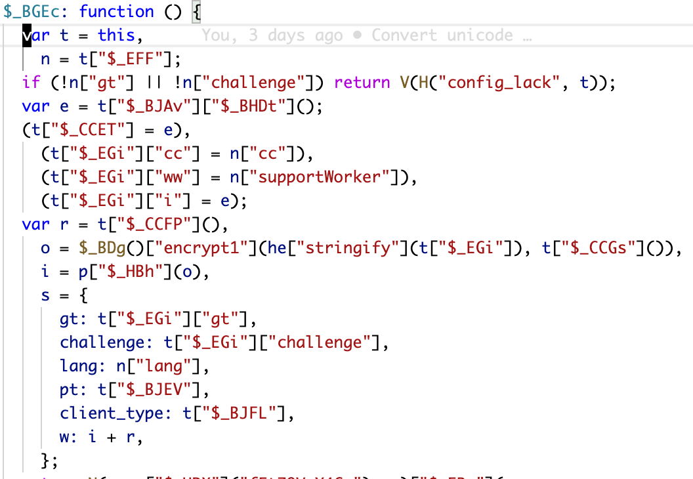
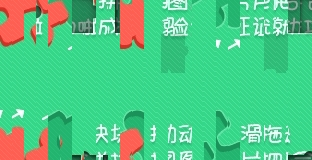

# README

# 极验滑块验证逆向分析

不少极验滑块验证的破解都是通过 `selenium` 这类自动化工具模拟人的滑动来通过验证，而随着极验对行为识别的升级，这种破解方案越来越容易被识别为机器人，而通过定期更新大量真实滑动轨迹数据，再直接构造参数提交请求的方案来通过验证会是一个不错的突破口。

以下分析基于极验 7.8.6 版本，代码仅作为学习研究使用；

## 逆向分析目标

尝试登录使用了极验验证的网站，可以发现最终登录接口会带上跟极验验证相关的字段：`geetestChallenge`, `geetestSeccode`,`geetestValidate`，其中 `geetestSeccode` 只比 `geetestValidate` 多了 `|jordan` 的后缀。

<p align="start" >

 </p>

而 `geetestChallenge` 则只需仿照 web 端构造请求获得

<p align="start">

</p>

因此如何取得 `geetestValidate` 才是逆向分析的重点。

## 极验验证的请求链

随便拖动一下滑块让验证失败，根据 log 发现涉及 geetest 验证的整个请求链如下：

| 流程            | 关键请求参数                     | 关键响应参数               |
| --------------- | -------------------------------- | -------------------------- |
| getCaptcha      | 各网站后端实现不一，不在讨论范围 | gt，challenge              |
| 第一次 get.php  | gt, challenge, w                 | status: 需确保 success     |
| 第一次 ajax.php | gt, challenge, w                 | status: 需确保 success     |
| 第二次 get.php  | gt, challenge                    | c, s, fullbg, bg, gct_path |
| 第二次 ajax.php | gt, challenge, w                 | validate                   |

<p align="start">

</p>

再尝试一次成功的验证，注意 developer tools 上勾选 preserve log。

<p align="start">

</p>

第二次请求 `ajax.php` 返回的 `validate` 既是前面提到的 `geetestValidate`, 请求链代码大致如下：

```javascript
requestCaptcha()
  .then(({ gt, challenge }) => {
    return requestGetPHP(STEP.ONE, { gt, challenge });
  })
  .then(({ gt, challenge }) => {
    return requestAjaxPHP(STEP.ONE, { gt, challenge });
  })
  .then(({ gt, challenge }) => {
    return requestGetPHP(STEP.TWO, { gt, challenge });
  })
  .then(({ gt, challenge, c, s, bg, fullbg, gctpath }) => {
    return (async function () {
      const offset = await calculateOffset(bg, fullbg);
      const track = getTrack(offset);
      const imgload = parseInt(Math.random() * 20 + 50);
      const passtime = track[track.length - 1][2];
      const gctPayload = await execGctjs(gctpath);
      return {
        gt,
        challenge,
        offset,
        track,
        passtime,
        imgload,
        c,
        s,
        gctPayload,
      };
    })();
  })
  .then((data) => {
    return requestAjaxPHP(STEP.TWO, data);
  });
```

但整个请求链又多了三个 `w` 参数, 因此我们的目标需要转移到对三个 `w` 参数的构造。

## 构造参数

注意到下图中的三个 js 文件，根据调用顺序大致猜测，`fullpage.xxx.js` 可能涉及构造`第一次的 get.php 请求`，`第一次的 ajax.php 请求`，`slide.xxx.js` 可能涉及构造 `第二次的 get.php 请求`，`第二次的 ajax.php 请求`，最后的 `gct.xxx.js`也可能涉及构造 `第二次的 ajax.php 请求`。

<p align="start">

</p>

基于上面的猜测，我们将三个 js 文件拷贝下来，并进行格式化

<p align="start">

</p>

首先需要将大量的 unicode 码转化成 ascii 码，这一步只需在 vscode 上找个 plugin 来完成，这里使用 [native-ascii-converter](https://marketplace.visualstudio.com/items?itemName=cwan.native-ascii-converter) 做转换。

尝试在代码中搜索 `challenge` 等关键字，发现一些疑似构造请求的关键代码:

<p align="start">

</p>

如下经过混淆的 js 代码实在难以阅读，经过 AST 工具发现大量类似以 `$_CFAGh(143)` 形式混淆的变量名都最终调用同一个方法，基于此简单编写还原变量名的代码，将三个 js 文件一并还原。更好的做法是通过处理 AST 进行反混淆，但这里足够应付。

```javascript
async function convert(varPattern, filepath, convertFn) {
  const lines = [];
  const fileStream = fs.createReadStream(filepath);
  const rl = readline.createInterface({
    input: fileStream,
    crlfDelay: Infinity,
  });
  for await (const line of rl) {
    const groups = line.matchAll(varPattern);
    let newLine = line;
    for (const group of groups) {
      const newText = convertFn(parseInt(group[1]));
      newLine = newLine.replace(group[0], '"' + newText + '"');
    }
    lines.push(newLine);
  }
  const content = lines.join("\n");
  fs.writeFileSync(`${filepath.replace(".js", ".converted.js")}`, content);
}

const fullpagejsVariantsPattern = /\$_[a-zA-Z]{3,5}_?\((\d+)\)/g;
const slidejsVariantsPattern = /\$_[a-zA-Z]{3,5}_?\((\d+)\)/g;
const gctjsVariantsPatten = /[a-zA-Z]{3,5}_?\((\d+)\)/g;

convert(fullpagejsVariantsPattern, "geetest/fullpage.js", FAwFx.$_AU.$_DEHDy);
convert(slidejsVariantsPattern, "geetest/slide.js", lTloj.$_AG.$_DBHFa);
convert(gctjsVariantsPatten, "geetest/gct.js", ArXuv.Bak.sfR);
```

还原后类似如下的干扰代码也可以一并删除

```javascript
var $_CFAFI = FAwFx.$_CQ,
  $_CFAEl = ["$_CFAIF"].concat($_CFAFI),
  $_CFAGh = $_CFAEl[1];
$_CFAEl.shift();
var $_CFAHk = $_CFAEl[0];
```

<p align="start">

</p>

此时代码的可读性大大提高，类似 `encrypt1`,`stringify` 关键词已经可以猜测它们的用途并进行追踪。如 `encrypt1` 是加密类的方法，`he["stringify"]()` 实际是 `JSON.stringify()`。最终整理出构造三个 `w` (`fullpageW`, `fullpageW2`, `slideW`) 的方法：

- fullpageW

  ```javascript
  //fullpage.reversed.js
  function w(gt, challenge, seed) {
    var r = $_CCFP(seed);
    var encrypted = new $_BDg().encrypt1(
      JSON.stringify(o(gt, challenge)),
      seed
    );
    var { res, end } = $_GJq(encrypted);
    var i = res + end;
    return i + r;
  }
  ```

- fullpageW2

  ```javascript
  // fullpage.reversed2.js
  var w = "";
  var _ = $_BDg();
  ($_CEGn = (function l() {
    var t = ["bbOy"];
    return function (e) {
      t["push"](e["toString"]());
      var r = "";
      !(function o(e, t) {
        function n(e) {
          var t = 5381,
            n = e["length"],
            r = 0;
          while (n--) t = (t << 5) + t + e["charCodeAt"](r++);
          return (t &= ~(1 << 31));
        }
        100 < new Date()["getTime"]() - t["getTime"]() && (e = "qwe"),
          (msg["captcha_token"] = n(
            o["toString"]() + n(n["toString"]()) + n(e["toString"]())
          )),
          (r = JSON.stringify(msg));
      })(t["shift"](), new Date()),
        (w = p["$_HBh"](_["encrypt"](r, seed)));
    };
  })()),
    $_CEGn("");
  return w;
  ```

- slideW

  ```javascript
  /**
   *
   * @param {*} gt
   * @param {*} challenge
   * @param {*} seed
   * @param {*} offset     滑动位移
   * @param {*} track      滑动轨迹数据
   * @param {*} passtime   滑动时间
   * @param {*} imgload    图片加载时间
   * @param {*} c          请求 get.php 获得
   * @param {*} s          请求 get.php 获得
   * @param {*} gtcPayload 执行 gtc.xxx.js 获得
   * @returns
   */
  function w(
    gt,
    challenge,
    seed,
    offset,
    track,
    passtime,
    imgload,
    c,
    s,
    gctPayload
  ) {
    var o = {
      lang: "zh-cn",
      userresponse: getUserResponse(offset, challenge),
      passtime: passtime,
      imgload: imgload,
      aa: $_BBCA($_GEy(track), c, s),
      ep: getEP(),
      rp: j(`${gt}${challenge.slice(0, 32)}${passtime}`),
    };
    var u = $_CCFP(seed);
    var l = new $_BDg().encrypt(JSON.stringify({ ...o, ...gctPayload }), seed);
    var h = $_GFM(l);
    return h + u;
  }
  ```

  其中构造出 `fullpageW` 和 `fullpageW2` 较为容易从已知的`gt`, `challenge` 即可构造出来，而 `slideW` 需要更多的信息进行构造，其中关键的包括：

- `offset`: 滑块位移;

- `track`: 滑块滑动轨迹数据，通过 `offset` 获得；

- `gctPayload`: 通过执行 `gct.xxx.js` 获得，值得注意的是此文件需要动态更新，需要通过 `第二次 get.php 请求` 可获得 `gct.xxx.js` 文件路径;

### 滑块位移和滑动轨迹数据

通过 `第二次 get.php 请求`，获得 `bg`, `fullbg` 的图片路径, 图片如下：

<p align="start">

</p>

这里直接调用流传较广的还原图片和计算滑动位移的 python 代码，js 里并没找到类似 python PIL 的知名的库。

```javascript
const util = require("util");
const exec = util.promisify(require("child_process").exec);
async function calculateOffset(bg, fullbg) {
  return Promise.resolve().then(() =>
    (async function () {
      const { stdout } = await exec(`python3 python/img.py ${bg} ${fullbg}`);
      const offset = parseInt(stdout.toString());
      return offset;
    })()
  );
}
```

### gct payload

`gct payload` 需要动态执行 `gct.xxx.js` 获取

```javascript
async function execGctjs(gctpath) {
  const response = await request("GET", gctpath, {}, header);
  const js = response.data;
  const pattern = /return\s(function\(t\)\{[\s\S]*?\});/g;
  const gctFn = js.match(pattern)[0];
  const payload = { lang: "zh-cn", ep: getEP() };
  const newjs =
    "window={};" +
    js.replace(
      pattern,
      `window._gct=${gctFn.replace(/^return/, "")};\n${gctFn}`
    ) +
    `function execGct(ep){window._gct(ep);return ep;}; execGct(${JSON.stringify(
      payload
    )})`;
  return eval(newjs);
}
```

## 总结

至此，对极验 7.8.6 版本关键参数的分析完毕，具体参考源码，极验每一个版本都会对流程或者参数等有不同程度的修改，因此不能保证代码持续有效，这里仅仅提供逆向思路并做下记录。
